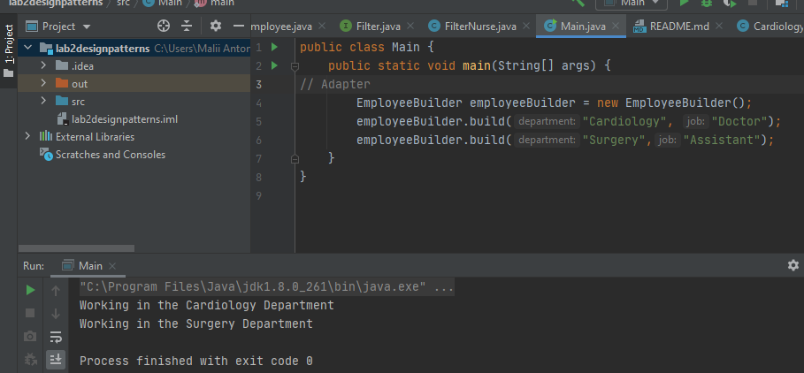
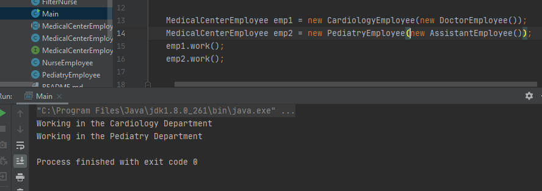
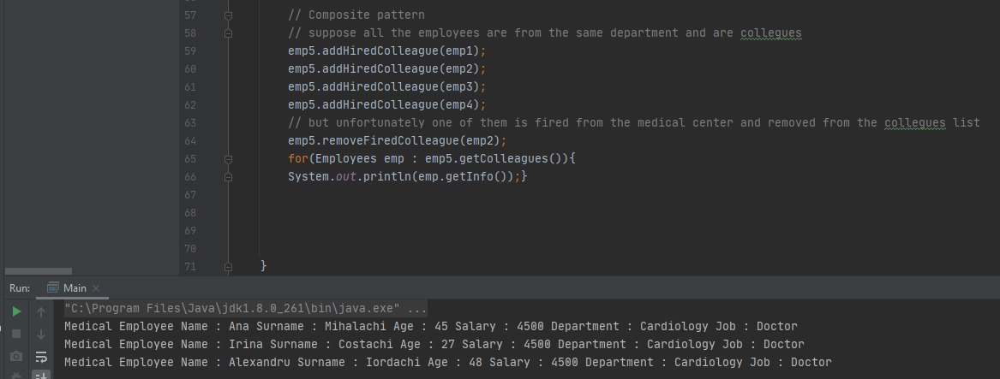

# Lab.2 Topic: *Structural Design Patterns*

------
## Table of Contents

* [Objectives](#objectives)
* [Some Theory](#theory)
* [Main Tasks](#main-tasks)
* [Implementation](#implementation)
* [Conclusions](#conclusions)
* [Author](#author)
------
## Objectives:

__1. Study and understand the Structural Design Patterns.__

__2. As a continuation of the previous laboratory work, think about the functionalities that your system will need to provide to the user.__

__3. Implement some additional functionalities using structural design patterns.__

## Some Theory :

In software engineering, the Structural Design Patterns are concerned with how classes and objects are composed to form larger structures. Structural class patterns use inheritance to create a hierarchy of classes/abstractions, but the structural object patterns use composition which is generally a more flexible alternative to inheritance.

Some examples of this kind of design patterns are :

   * Adapter- Allows objects with incompatible interfaces to collaborate;
   * Bridge- Lets you split a large class, or a set of closely related classes into two separate hierarchies
   * Composite- Lets you compose objects into tree structures and then work with these structures as if they were individual objects;
   * Filter- Can combines multiple criteria to obtain single criteria.
   * Decorator- Lets you attach new behaviors to objects by placing these objects inside special wrapper objects that contain the behaviors;
   * Facade- Wraps a complex sub-system with a simple abstraction.
   * Flyweight- Lets you fit more objects into the available amount of RAM by sharing common parts of state between multiple objects instead of keeping all the data in each object.
   * Proxy- Lets you provide a substitute or placeholder for another object. A proxy controls access to the original object, allowing you to perform something either before or after the request gets through to the original object;
   
   
## Main tasks :

__1. Study and understand the Structural Design Patterns.__

__2. Determine the additional functionalities of the system.__

__3. Based on the previous point, implement at least 3 structural design patterns in your project;__

## Implementation

In this lab it was implemented a project based on medical center (hospital) human resources data manipulation;

This project illustrates the implementation of the following structural design patterns:
   * __Adapter__
   * __Bridge__
   * __Composite__
   
 
In this lab we have a hospital which has employees that are working in 3 different departments and have a set of attributes like: name, surname, age, salary, job type and a list of colleagues.
Each department has 3 types of available job types: doctor, assistant and nurse. The main object of our project is the __MedicalCenterEmployee__. This abstract class also has an attribute which is an interface used to differentiate employees between departments, __MedicalCenterEmployeeAPI__.
The __MedicalCenterEmployee__ is extended by the class __Employees__ that has all the basic attributes with the information about the specific employee and the list of colleagues. 

__1.Adapter__

Adapter is a design pattern that allows objects with incompatible interfaces to collaborate. For the Adapter pattern It was implemented 2 classes, the __MedicalCenterEmployeeAdapter__ and __EmployeeBuilder__. In the __EmployeeBuilder__, first we see if the department is valid, create the adapter and then execute the specific method, as we have 3 specialized classes __CardiologyEmployee__, __PediatryEmployee__ and __SurgeryEmployee__ . 

~~~
MedicalCenterEmployeeAdapter(String department, String job) {
        if (department.equalsIgnoreCase("Cardiology")){
            medicalEmployee = new CardiologyEmployee(job.equalsIgnoreCase("Doctor") ?  new DoctorEmployee() : (job.equalsIgnoreCase("Assistant")) ? new AssistantEmployee():  new NurseEmployee());
        } else if (department.equalsIgnoreCase("Surgery")){
            medicalEmployee = new SurgeryEmployee(job.equalsIgnoreCase("Doctor") ? new DoctorEmployee() : (job.equalsIgnoreCase("Assistant")) ? new AssistantEmployee() :  new NurseEmployee());
        } else {
            medicalEmployee = new PediatryEmployee(job.equalsIgnoreCase("Doctor") ? new DoctorEmployee() : (job.equalsIgnoreCase("Assistant")) ? new AssistantEmployee() : new NurseEmployee());
        }
    }
~~~
~~~
public class CardiologyEmployee extends Employees{
    CardiologyEmployee(MedicalCenterEmployeeAPI medicalAPI){
        super(medicalAPI);
        super.setDepartment("Cardioloogy");
    }
    public void work() {
        System.out.println("Working in the Cardiology Department");
    }

}

~~~

Bellow you can see the results:

__2.Bridge__

Bridge is a design pattern that lets you split a large class, or a set of closely related classes into two separate hierarchies.

The variable medicalAPI is used in the __Employee__ class which is the bridge between the implementation and the abstract class __MedicalCenterEmployee__. In fact, it is used a reference to the interface __MedicalCenterEmployeeAPI__. Depending on the job of the employee, we have different classes which implement different methods from the interface.

~~~
public class AssistantEmployee implements MedicalCenterEmployeeAPI {

    public void qualification(String department){
        if (department.equalsIgnoreCase("Cardiology")){
            System.out.println("Assistant in Cardiology has to have at least 4 years of experience.");
        } else if(department.equalsIgnoreCase("Pediatry")){
            System.out.println("Assistant in Pediatry has to have at least 2 years of experience.");
        } else {
            System.out.println("Assistant in Surgery has to have at least 6 years of experience.");
        }
    }
}
~~~
I.e to create an object(employee) in this case it is necessary to  give to it also a reference to the class which implements the API depending on the job and department of the employee.

Bellow you can see the results:

__3.Composite__

Composite design pattern lets you compose objects into tree structures and then work with these structures as if they were individual objects;
In this case, in the __Employees__ class, where we have all the basic attributes, it was added a group of objects in the form of a list of __colleagues__, this group of objects can be treated in a simmilar manner, which actually represents the implementation of the __Composite Pattern__.
 
~~~
public class Employees extends MedicalCenterEmployee {

    private String name;
    private String surname;
    private Integer age;
    private Integer salary;
    private String department;
    private String job;
    private List<Employees> colleagues;

...

    public void addHiredColleague(Employees newEmployee) {
        this.colleagues.add(newEmployee);
    }

    public void removeFiredColleague(Employees firedEmployee){
        this.colleagues.remove(firedEmployee);
    }
...

~~~

Bellow you can see the results:

## Conclusions

The main goal of this laboratory work was to put into practice Structural Design Patterns.
After studying all the theory and putting it into practice in this laboratory work, 
I straighten my knowledge about Design Patterns, and namely about SDPs.
In short, they focus on how classes and objects can be composed into larger structures
and at the same time to keep these structures flexible and efficient. 
Another challenge that I have faced was to respect the project structure, but from my point of view, I managed to do it not so bad.

## Author: 

__Malîi Antonela FAF-192__