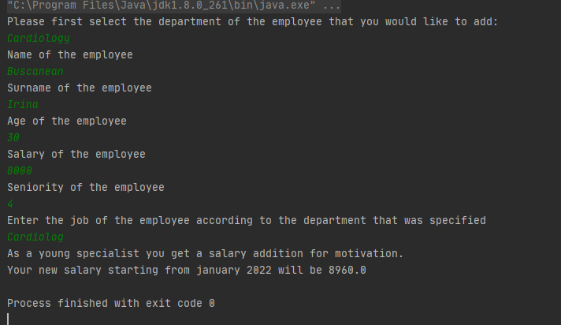
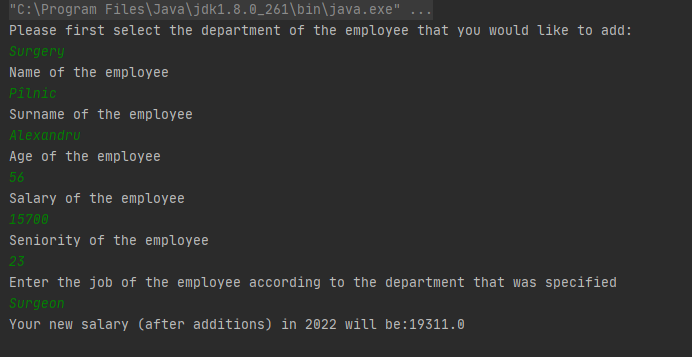

# Lab.3 Topic: *Behavioral Design Patterns*

------
## Table of Contents

* [Objectives](#objectives)
* [Some Theory](#theory)
* [Implementation](#implementation)
* [Results](#results)
* [Conclusions](#conclusions)
* [Author](#author)
------
## Objectives:

__1. Study and understand the Behavioral Design Patterns.__

__2. Determine the additional functionalities of the system;__

__3. Implement at least 1 BDPs for the specific domain;__

## Some Theory :

In software engineering, *behavioral design patterns* are design patterns that identify common communication patterns between objects and realize these patterns.
By doing so, these patterns increase flexibility in carrying out this communication.
Behavioral patterns are concerned with the assignment of responsibilities between objects, or, encapsulating behavior in an object and delegating requests to it.
Unlike the Creational and Structural patterns, which deal with the instantiation process and the blueprint of objects and classes, the central idea here is to concentrate on the way objects are interconnected.

* __Mediator Design Pattern__

Mediator helps in establishing loosely coupled communication between objects and helps in reducing the direct references to each other.

* __Observer Design Pattern__

Observer pattern defines a one-to-many dependency between objects so that when one object changes state, all its dependents are notified and updated automatically.
It is also referred to as the publish-subscribe pattern.

* __State Design Pattern__

A state allows an object to alter its behavior when its internal state changes. The object will appear to change its class.

* __Memento Design Pattern__

Memento pattern is used to restore state of an object to a previous state. It is also known as snapshot pattern.
The intent of memento pattern is to capture the internal state of an object without violating encapsulation and thus providing a mean for restoring the object into initial state when needed.

* __Iterator Design Pattern__

An iterator design pattern provides a way to access the elements of an aggregate object sequentially without exposing its underlying representation.

* __Command Design Pattern__

Command pattern is a behavioral design pattern which is useful to abstract business logic into discrete actions i.e. commands. It motivates loose coupling.

* __Strategy Design Pattern__

Strategy design pattern is behavioral design pattern where we choose a specific implementation of algorithm or task in run time – out of multiple other implementations for same task.

* __Template Method Design Pattern__

Template method design pattern is widely accepted behavioral design pattern to enforce some sort of algorithm (fixed set of steps) in the context of programming.
It defines the sequential steps to execute a multi-step algorithm and optionally can provide a default implementation as well (based on requirements).

* __Visitor Design Pattern__

The visitor design pattern is a way of separating an algorithm from an object structure on which it operates.
A practical result of this separation is the ability to add new operations to existing object structures without modifying those structures.

* __Chain of Responsibility Design Pattern__

The main objective of this pattern is that it avoids coupling the sender of the request to the receiver, giving more than one object the opportunity to handle the request.

## Implementation

__In this lab it was implemented a project based on medical center (hospital) human resources data instatiation;__

__This project illustrates the implementation of the following behavioural design patterns:__
   * Strategy

First, I created the *Context Class* because based on this class we will change the behaviour of the future strategy that will be used in our project.
~~~
public class Context {
    private Strategy strategy;
    public Context(Strategy strategy){
        this.strategy=strategy;
    }

    public double execStrategy(double salary, double seniority){
        return strategy.calculateSalaryAddition(salary, seniority);
    }
}

~~~

The strategy that I have chosen is based on the idea of changing the salary of medical center employees based on their seniority (i.e years worked in the hospital).
That's why, I created the interface *Strategy* and the concrete classes *YoungSpecialists* and *SeniorityAddition* .
If an employee has worked in hospital for more than 5 years, he will receive an addition of 1% to the salary for each worked year.
On the other hand, if the employee is a young specialist with less than 5 years worked in the hospital, he will receive a 3% addition as a motivation.

~~~
public interface Strategy {
    double calculateSalaryAddition(double salary, double seniority);
}
~~~

~~~
public class YoungSpecialistsAddition  implements Strategy{
    @Override
    public double calculateSalaryAddition(double salary, double seniority) {
        return salary+seniority*0.03*salary;
        // for young specialists we add 3% to the salary as a motivation
    }
}

public class SeniorityAddition implements Strategy {
    @Override
    public double calculateSalaryAddition(double salary, double seniority) {
        return salary+0.01*salary*seniority;
        // for each year worked in the hospital we add 1 % to the salary
    }
}
~~~

## Results

## Conclusions

The main goal of this laboratory work was to put into practive Behavioral Design Patterns.
Generally speaking, design patterns are a very important field of computer science that is important in order to become a developper,
as design patterns are reusable in multiple projects and provide solutions that can help
define and build a good system architecture.

## Author: 

__Malîi Antonela FAF-192__